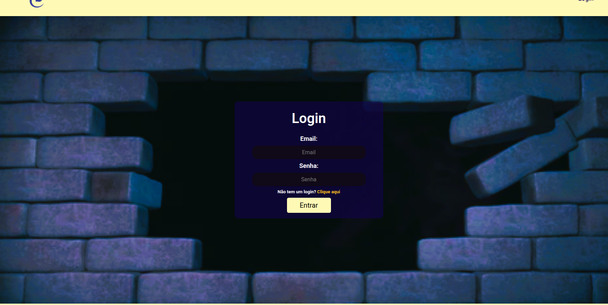
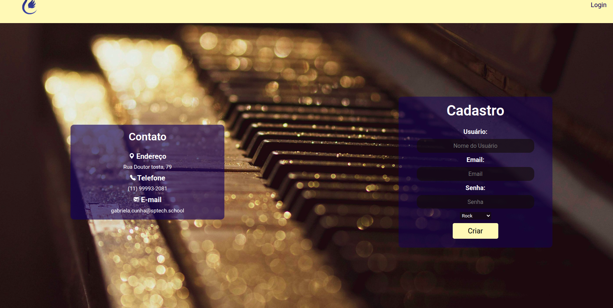

# LearnTot

 Um projeto individual da SPTech, para a disciplina de PI - Projeto e Inovação. 

## Índice
- <a href="#funcionalidades-do-projeto"> Funcionalidades do Projeto </a>
- <a href="#protótipo"> Protótipo </a> 
- <a href="#tecnologias-utilizadas"> Tecnologias Utilizadas </a> 
- <a href="#autores"> Autores </a> 
- <a href="#próximos-passos"> Próximos Passos </a>

## Funcionalidades do Projeto
- [x] Login e cadastro.
- [x] Armazenamento dos dados no banco de dados.
- [x] Exibir dashboards com dados do BD.
- [x] Mostrar traduções das minhas músicas favoritas.
- [x] Comentar e avaliar as traduções

## Protótipo
- Página Inicial

- Página de Login

- Página de Cadastro

## Tecnologias Utilizadas
1. [Canva](https://www.canva.com/pt_br/)
2. [VSCode](https://code.visualstudio.com)
3. [MySQL Workbench](https://www.mysql.com/products/workbench/)
4. [Oracle Virtual Box](https://www.virtualbox.org/wiki/Downloads)
   

## Autora
- Gabriela Pinheiro Lopes da Cunha, 

## Próximos Passos
- [ ] Expandir a quantidade de músicas.
